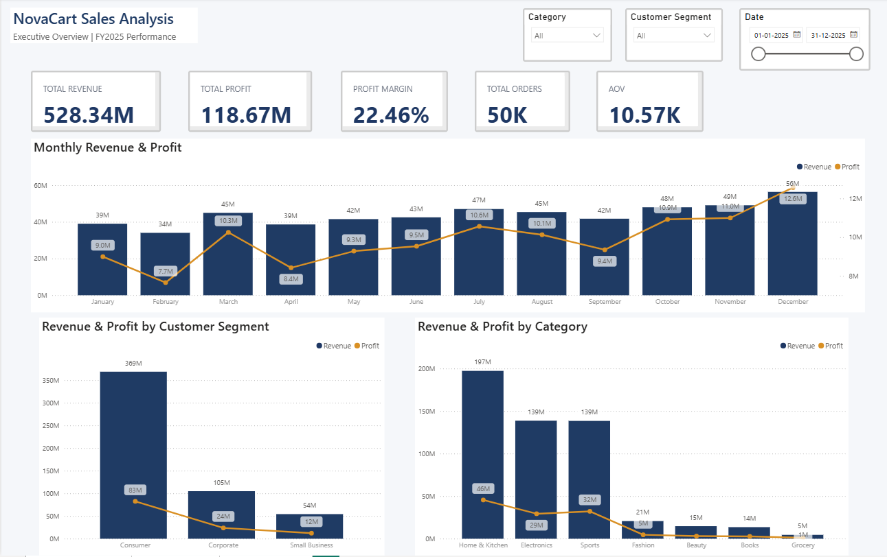
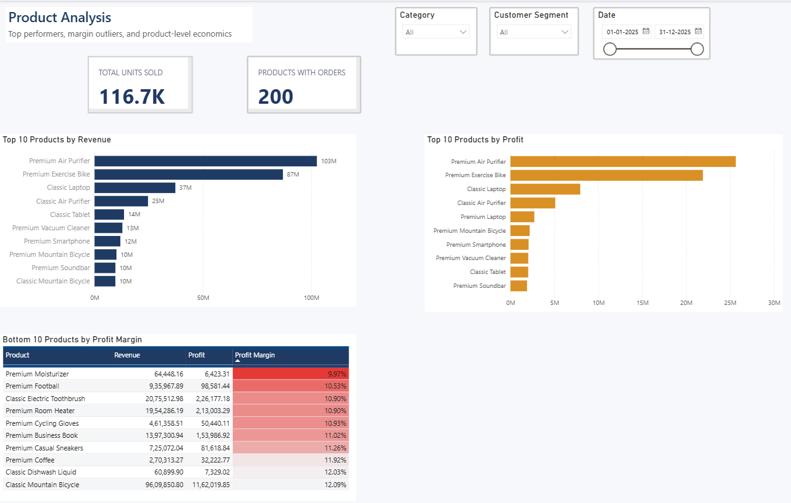
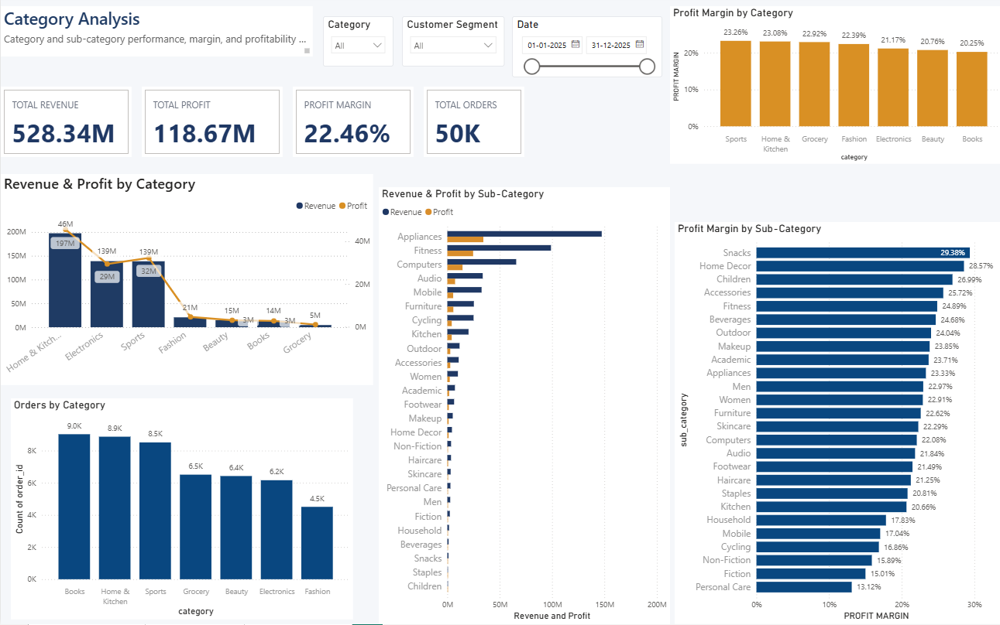

# NovaCart Sales Analysis

An end-to-end business analytics project using **MySQL, SQL, Python, and Power BI** to evaluate sales performance, profitability, products, customers, categories, discounts, order behavior, and geographic markets.

## Project Overview

NovaCart is a transactional sales dataset containing customer, product, and order information for 2025. The project follows a complete analytics workflow:

**Data Validation → SQL Business Analysis → Python Analysis → Power BI Visualization → Business Insights & Recommendations**

The objective is not only to calculate KPIs, but to identify the business drivers behind revenue and profit and convert them into actionable recommendations.

## Business Problem

NovaCart needs to understand:

- What is driving revenue and profit?
- Which categories and products perform best?
- Which products generate sales but have weak margins?
- Which customer segments and states contribute most to the business?
- How does discounting affect profitability?
- How does order quantity affect order value?
- How concentrated is revenue across the top products and customers?
- Where are the strongest opportunities for profitable growth?

## Project Objectives

- Validate data completeness, consistency, uniqueness, referential integrity, and financial calculations.
- Measure overall sales, revenue, profit, profit margin, order volume, and average order value.
- Analyze monthly, category, sub-category, product, customer, segment, and state-level performance.
- Evaluate the relationship between discounts and profitability.
- Analyze order quantity and average order revenue.
- Measure revenue concentration among top products and customers.
- Use Python for analytical validation and supporting visualizations.
- Build interactive Power BI dashboards for business reporting.
- Translate analytical findings into business recommendations.

## Dataset

The project uses three relational datasets:

| Dataset | Description |
|---|---|
| `customers` | Customer ID, name, city, state, and customer segment |
| `products` | Product ID, product name, category, sub-category, unit cost, and unit price |
| `orders` | Order ID, customer, product, order date, quantity, discount, revenue, and profit |

### Dataset Scale

| Metric | Value |
|---|---:|
| Customers | 2,000 |
| Products | 200 |
| Orders | 50,000 |
| Unique Orders | 50,000 |
| Date Range | Jan 1, 2025 – Dec 31, 2025 |
| Units Sold | 116,689 |

The `orders` table is the central transaction table and connects to `customers` through `customer_id` and to `products` through `product_id`.

## Database Schema

### Customers

- `customer_id` — Primary Key
- `customer_name`
- `city`
- `state`
- `customer_segment`

### Products

- `product_id` — Primary Key
- `product_name`
- `category`
- `sub_category`
- `unit_cost`
- `unit_price`

### Orders

- `order_id` — Primary Key
- `customer_id` — Foreign Key
- `product_id` — Foreign Key
- `order_date`
- `quantity`
- `discount`
- `revenue`
- `profit`

### Relationships

```text
customers.customer_id  →  orders.customer_id
products.product_id    →  orders.product_id
```

## Tools & Technologies

- **MySQL / SQL** — Database creation, validation, joins, aggregations, KPI calculations, and business analysis.
- **Python / Pandas** — Exploratory analysis, analytical validation, calculations, and supporting visualizations.
- **Matplotlib** — Python-based analytical charts.
- **Power BI** — Interactive dashboards, slicers, KPIs, and business visualization.
- **CSV** — Source data format.
- **GitHub** — Version control and project presentation.

## Project Workflow

### 1. Data Validation

The data was validated before business analysis using checks for:

- record counts and uniqueness
- missing values
- date coverage
- customer and product referential integrity
- quantity and discount ranges
- revenue calculations
- profit calculations
- customer and product coverage

Revenue was validated using the product price, quantity, and discount. Profit was validated as revenue less product cost.

### 2. SQL Business Analysis

SQL was used to answer the core business questions across:

- overall KPIs
- monthly performance
- category and sub-category performance
- product performance
- customer performance
- customer segments
- state-level performance
- discount impact
- order quantity and order value
- top products by profit
- low-margin products
- product revenue concentration

### 3. Python Analysis

Python was used to reproduce and validate the major business calculations and create focused analytical visualizations for:

- discount vs. profit margin
- quantity vs. average order revenue
- monthly revenue trend
- monthly profit trend
- category revenue

### 4. Power BI Dashboard

The Power BI report contains three analytical pages.

#### Executive Dashboard

Provides an executive-level overview with:

- Total Revenue
- Total Profit
- Profit Margin
- Total Orders
- Total Units Sold
- Order Date filter
- Category filter
- Customer Segment filter
- Monthly Revenue Trend
- Monthly Profit Trend
- Revenue by Product Category
- Profit by Product Category
- Revenue by Customer Segment
- Profit by Customer Segment

#### Product Analysis

Focuses on product-level performance with:

- Top 10 Products by Revenue
- Top 10 Products by Profit
- Bottom 10 Products by Profit Margin

#### Category Analysis

Provides category and sub-category comparisons using:

- Revenue by Category
- Profit by Category
- Profit Margin by Category
- Orders by Category
- Revenue by Sub-Category
- Profit by Sub-Category
- Profit Margin by Sub-Category

## Key Business Results

| KPI | Result |
|---|---:|
| Total Orders | 50,000 |
| Total Units Sold | 116,689 |
| Total Revenue | ₹528.34M |
| Total Profit | ₹118.67M |
| Overall Profit Margin | 22.46% |
| Customers with Orders | 1,974 |
| Products with Orders | 200 |
| Average Order Value | ₹10,566.80 |
| Average Discount | 10.34% |

## Key Business Findings

### Monthly Performance

- **December** recorded the highest monthly orders, revenue, and profit.
- **February** recorded the lowest monthly revenue and order volume.
- Performance was generally stronger in the second half of the year, with a particularly strong October–December period.
- Monthly profit margins remained relatively stable at approximately **21.80%–23.04%**.

### Category Performance

- **Home & Kitchen** generated the highest revenue and profit.
- **Sports** combined strong revenue and profit with the highest category margin at **23.26%**.
- **Books** recorded the highest order and unit volume but the lowest category margin at **20.25%**.
- **Electronics** generated high revenue but had a lower margin of **21.17%**.
- **Grocery** had the lowest revenue while maintaining a margin of **22.92%**.

### Product Performance

- **Premium Air Purifier** was the strongest product by revenue and profit.
- **Premium Exercise Bike** was the second-highest revenue contributor and achieved a **25.19%** margin.
- Some high-revenue products also had relatively weak margins, including **Classic Tablet (14.85%)** and **Classic Mountain Bicycle (12.09%)**.
- Low-margin products included items operating around **10%–14% margins**, well below the overall business margin.

### Customer & Segment Performance

- **Consumer** was the largest customer segment and the primary contributor to revenue and profit.
- **Corporate** customers recorded the highest segment profit margin at **22.67%**.
- **Maharashtra** was the largest state market by customers, orders, units, revenue, and profit.
- **Tamil Nadu** recorded the highest state-level profit margin at **23.08%**.

### Discount & Profitability

- Profit margin decreased consistently as discount levels increased.
- Margin fell from **30.47% at 0% discount** to **1.04% at 30% discount**.
- The **10% discount** level generated the highest order and unit volume.
- Discounts above **15%** materially reduced profitability.

### Order Quantity & Order Value

- One-unit orders were the most frequent, with **20,122 orders**.
- Two-unit orders generated the highest total revenue at **₹119.82M**.
- Average order revenue increased substantially as order quantity increased.
- Profit margins remained broadly stable across most order quantities.

### Revenue Concentration

- The **top 10 products generated approximately ₹319.25M, or 60.43% of total revenue**.
- The **top 10 customers generated approximately ₹29.04M, or 5.50% of total revenue**.
- This indicates relatively high product-level concentration but low dependence on a small number of individual customers.

## Business Insights & Recommendations

### 1. Prioritize High-Performing Products and Categories

Maintain strong inventory availability and promotional visibility for products and categories that combine high revenue with healthy margins, particularly Home & Kitchen and leading products such as Premium Air Purifier and Premium Exercise Bike.

### 2. Review Low-Margin Products

Evaluate pricing, supplier costs, and discount levels for products operating well below the overall 22.46% margin. High-volume low-margin products should receive particular attention.

### 3. Control Excessive Discounting

Use targeted promotions rather than broad high-discount strategies. The sharp decline in margin at higher discount levels suggests that discount effectiveness should be evaluated using both sales volume and profitability.

### 4. Increase Order Value

Use bundles, cross-selling, and complementary-product recommendations to encourage larger baskets, while monitoring whether incremental volume preserves acceptable margins.

### 5. Investigate Seasonal Performance

Review the drivers behind the strong October–December period and determine which seasonal campaigns, product mixes, or purchasing patterns can be repeated.

### 6. Strengthen Customer Segment Strategies

Continue retaining the large Consumer customer base while developing targeted relationship and retention strategies for Corporate and Small Business customers.

### 7. Manage Product Concentration

Because the top 10 products contribute approximately **60.43% of total revenue**, NovaCart should protect availability of key products while also developing a broader portfolio to reduce dependence on a limited product set.

## Overall Recommendation

NovaCart should focus on **profitable growth rather than sales growth alone**. The strongest opportunities are margin improvement, disciplined discounting, higher-value baskets, protection of key products, and targeted expansion across profitable customers and markets.

## Project Deliverables

- **SQL analysis:** `novacart_sales_analysis.sql`
- **Python analysis:** `NovaCart_EDA(5).ipynb`
- **Power BI report:** NovaCart Power BI dashboard
- **Source data:** customers, products, and orders CSV files

## How to Run the Project

### 1. Create the Database

Open MySQL and run `novacart_sales_analysis.sql` to create the `novacart` database and its tables.

### 2. Load the Data

Load the three CSV files into:

- `customers`
- `products`
- `orders`

### 3. Run Validation and SQL Analysis

Execute the validation and business-analysis sections of the SQL script to reproduce the core results.

### 4. Run the Python Notebook

Open `NovaCart_EDA(5).ipynb` and run the notebook sequentially from the import/data-loading cells through the final Business Insights & Recommendations section.

### 5. Open the Power BI Report

Open the Power BI report to explore the Executive Dashboard, Product Analysis, and Category Analysis pages and interact with the available filters and slicers.

#### Executive Dashboard



#### Product Analysis



#### Category Analysis



## Project Conclusion

NovaCart Sales Analysis demonstrates an end-to-end approach to turning transactional sales data into actionable business insight. The project combines SQL-based data validation and business analysis, Python-based analytical validation and visualization, and Power BI-based interactive reporting to support data-driven decisions around revenue growth, profitability, products, customers, discounts, and market performance.
